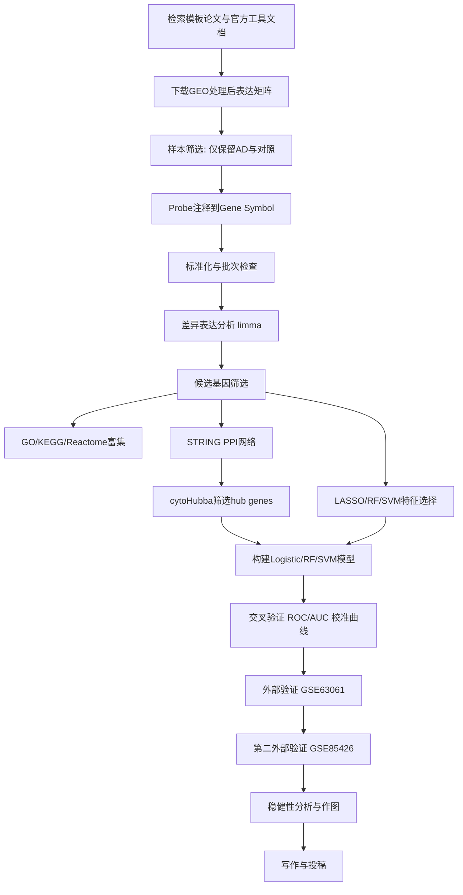
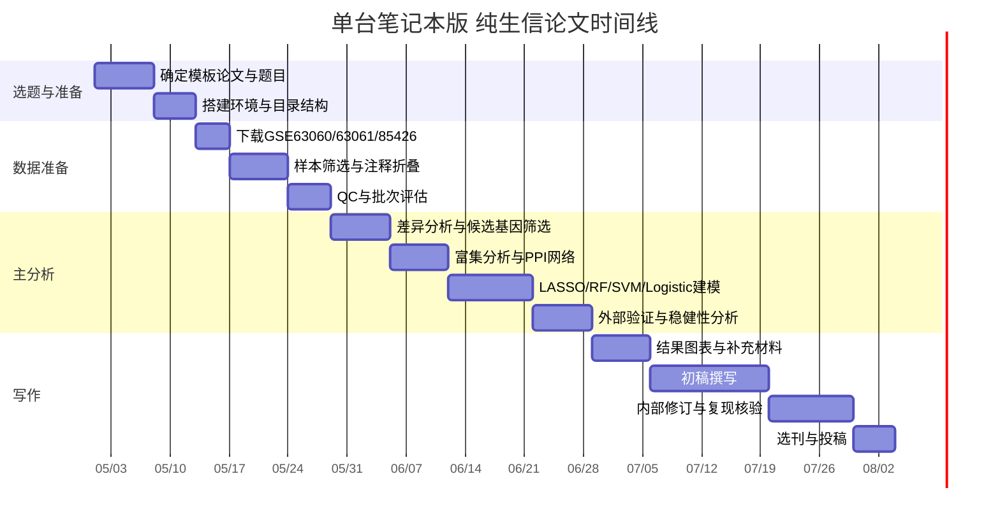

# 面向SCI三区的五步纯生信论文写作与实施计划

## 执行摘要

基于你的约束条件——**纯生信、不能依赖湿实验、不能用需注册网站、训练集样本量不少于200、保留独立外部验证、单台笔记本可跑、可用存储仅100GB**——我建议将“方法模板”和“实际选题”分开处理：**方法模板**选用一篇流程最完整、可直接映射到你要求的“五步法”的高质量英文原始论文；**实际课题方向**则选择一个在公开数据库中确实有足够样本、文件体量小、适合你电脑运行的方向。综合检索后，我建议把 **Li et al., 2025, Journal of Translational Medicine** 的 IBD 生信论文作为**主模板**，因为它最接近你要求的标准链条：**公共转录组挖掘 → 候选基因筛选 → GO/KEGG富集 → STRING/Cytoscape PPI网络 → 机器学习与外部验证**，而且方法学给出了较完整的软件版本与分析框架；与此同时，真正执行时我更推荐你把题目落在**阿尔茨海默病外周血微阵列转录组诊断模型**上，因为 **GSE63060** 单队列就能提供 145 例 AD + 104 例对照作为训练集，**GSE63061** 还能提供 139 例 AD + 134 例对照作独立外部验证，**GSE85426** 另有 90 例 AD + 90 例对照可作第二外部验证；三个队列的公开处理后文件体量都很小，远低于 100GB 存储上限，且全部来自开放的 GEO，无需注册。citeturn39view0turn40view0turn41search0turn25view0turn25view1turn25view2turn22search13turn23view4

结论上，这篇论文的前五步**本质上就是标准的纯生信套路**，只是不同论文在“第二步候选基因筛选”里会把 **DEG、WGCNA、先验基因集交集、机器学习特征选择** 组合使用，细节略有差别；你真正需要的不是机械复写某篇文章，而是把这五步**规范化、可复现化、并压缩到适合SCI三区的工作量与创新强度**。对你当前硬件而言，最稳妥的路线是：**公开微阵列/处理后表达矩阵 + limma差异分析 + STRING/Cytoscape网络 + LASSO/RF/SVM/Logistic建模 + 独立外部验证**，尽量避免原始 FASTQ、单细胞、空间转录组或过大的全流程重分析。citeturn31search32turn31search16turn36search11turn36search4turn36search16turn31search9turn31search15turn32search9

## 模板论文检索与选择

本次检索优先级按你的要求设置为：**英文原始论文 > 官方工具文档 > PubMed/Scopus/Web of Science 索引来源 > 公开数据仓库说明页**。方法论文筛选时，我优先看是否来自高质量期刊、是否有**独立验证集**、是否在方法部分给出**软件/版本/关键阈值**、是否完整覆盖你要求的五步框架。公开数据部分则优先使用 entity["organization","NCBI","us biomedical databases"] 维护的 GEO，以及 entity["organization","EMBL-EBI","Hinxton, Cambridgeshire, UK"] 的 ArrayExpress/BioStudies；两者都面向公开复用数据。citeturn31search32turn38search0turn38search2turn38search17

推荐的检索关键词组合如下，后续你自己复核时可以直接复制到 PubMed、Web of Science 或 Scopus：

| 检索目的 | 建议关键词 |
|---|---|
| 方法模板总检索 | `("GEO" OR "public transcriptome" OR microarray OR RNA-seq) AND (biomarker OR diagnostic model) AND ("machine learning" OR LASSO OR random forest OR SVM) AND (STRING OR Cytoscape OR PPI) AND ("external validation")` |
| 神经系统纯生信可执行方向 | `("Alzheimer disease" OR "ischemic stroke" OR "neurodegenerative disease") AND blood AND GEO AND transcriptome AND biomarker AND external validation` |
| 公式化五步流文章 | `differential expression AND enrichment AND PPI AND machine learning AND GEO AND diagnostic biomarker` |
| 工具官方文档 | `limma user guide Bioconductor`, `clusterProfiler Bioconductor`, `STRING database official`, `Cytoscape download official`, `scikit-learn stable` |

筛选标准建议写入你的方法学附录：**原始研究、英文、公开可复用数据、期刊质量至少达到你要求的 Q2 或更高、方法链条至少覆盖 4/5 个关键环节且最好有外部验证**。引用阈值若未指定，我建议采用**分层阈值**：发表 ≥3 年的论文优先总引文 ≥20；近两年论文则以**期刊质量 + 方法完整性 + 独立验证 + 透明软件版本**优先，可适当放宽总引文阈值，因为新文献引用累积时间短。这个阈值本身是策略性建议，不是硬性规则。  

在此标准下，我建议的**主模板论文**是：

**Li T, Jing H, Gao X, et al. Identification of key genes as diagnostic biomarkers for IBD using bioinformatics and machine learning. Journal of Translational Medicine, 2025.** 这篇文章发表在 entity["organization","Springer Nature","publisher group"] 旗下期刊 *Journal of Translational Medicine*；该刊官方 2024 JIF 为 7.5，WoS 百分位 87.7%，明显高于你要求的“至少Q2”的质量门槛。更关键的是，这篇文章在方法上几乎就是你要的“五步流”教科书版本：公开 GEO 数据、DEG + WGCNA 交叉筛选候选基因、clusterProfiler/DOSE 富集、STRING + Cytoscape + cytoHubba 做 PPI/hub gene、再用多种机器学习与外部队列评估 AUC。citeturn39view0turn40view0turn41search0turn41search6

如果你希望保留一个**神经系统方向的备选模板**，我建议同时记录两篇：一篇是 **Wang et al., 2024, Scientific Reports**，它完整实现了 **DEGs + WGCNA + PPI + 机器学习 + 外部验证**，只是病种是 AD、组织是脑组织；另一篇是 **Qin et al., 2022, Frontiers in Aging Neuroscience**，它直接使用了外周血的 **GSE63060/GSE63061** 做 AD 训练集与验证集，对你后续落地数据方案尤其有参考价值，但该文的 PPI/网络分析不如主模板完整，所以更适合作为**数据设计备份**而不是主要方法模板。citeturn18view0turn20view0turn21view2turn23view0turn23view4turn23view5

## 推荐课题与数据方案

我建议你把真正执行的题目定为：

**“基于公共外周血转录组与机器学习的阿尔茨海默病诊断标志物筛选及外部验证研究”**

这样选，不是因为它“最热门”，而是因为它**最符合你这台电脑和这篇文章的现实需求**。GEO 中的 AddNeuroMed 外周血队列 **GSE63060** 和 **GSE63061** 是非常合适的主数据源：GEO 页面显示二者分别有 329 和 388 个总样本，包含 AD、MCI 和对照；已有血液 AD 生信论文对其进一步拆分时，常用的 AD/对照子集分别约为 **145/104** 和 **139/134**。此外，**GSE85426** 还有 **90 例 AD + 90 例对照** 的外周血微阵列，可作为第二独立验证集。三者都能直接下载处理后的 TXT 文件，而且文件体量分别只有 **59.7MB、60.6MB 和 11.3MB** 左右；即便保留原始文件，总体也只是百兆级，很适合你目前 100GB 的存储空间。citeturn25view0turn25view1turn25view2turn26view0turn26view1turn26view2turn22search13turn23view4

### 推荐公开数据集清单

| 数据集 | 类型 | 推荐用途 | 公开样本信息 | 处理后下载体量 | 估计本地处理后占用 |
|---|---|---|---:|---:|---:|
| GSE63060 | 外周血微阵列 | 主训练集 | GEO 总样本 329；常用 AD/对照子集约 145/104 | 59.7 MB | 0.5–1 GB |
| GSE63061 | 外周血微阵列 | 主外部验证集 | GEO 总样本 388；常用 AD/对照子集约 139/134 | 60.6 MB | 0.5–1 GB |
| GSE85426 | 外周血微阵列 | 第二外部验证集 | 90 AD + 90 对照 | 11.3 MB | 0.2–0.5 GB |

表中 GEO 总样本数与文件大小来自各 GEO accession 页面；AD/对照子集数来自公开血液 AD 生信论文的拆分方式，因为原始 GEO 系列还包含 MCI，需要在建模时剔除。上表“本地处理后占用”是基于下载文本矩阵、平台注释文件、RDS 缓存和图表输出的保守估算。citeturn25view0turn25view1turn25view2turn26view0turn26view1turn26view2turn22search13turn23view4

### 为什么不把“合并多队列”作为主分析起点

因为你已经**拥有满足条件的单一训练集**：GSE63060 的 AD/对照子集已经 ≥200。既然主训练集已经达标，最稳妥的做法是：**先在单队列训练 → 再拿不同平台的独立队列外部验证**。这样更像真正的“泛化测试”，也避免一上来就把不同平台（Illumina V3、Illumina V4、Agilent）粗暴合并，增加批次效应和泄漏风险。若你后续需要进一步提升统计功效，可以把多队列合并作为**补充分析**，而不是主分析。citeturn25view0turn25view1turn25view2turn23view0turn23view4

### 若必须整合多GEO/ArrayExpress，建议采用的具体策略

若单一疾病方向下样本仍不足，建议遵循下面的合并规范，而不是直接 concatenate 表达矩阵：

1. **只保留同一比较框架**：例如都只保留 AD vs 正常对照，排除 MCI、混杂分型和重复时间点。  
2. **先做平台内预处理，再做 gene-level 合并**：用平台注释把 probe 映射到基因符号；重复 probe 取中位数或最大平均表达。  
3. **跨平台时优先做共同基因交集**，再对每个数据集做 gene-wise z-score 标准化。  
4. **同平台合并可优先用 ComBat**；跨平台若 PCA 仍按平台分群，建议改为**效应量元分析**或“训练-验证分离”，不要硬合并。  
5. **样本纳入标准**：必须有明确诊断标签、来源组织一致、年龄/性别等关键元数据尽量完整。  
6. **批次校正质控**：批次校正前后都保留 PCA / UMAP / RLE / 箱线图对照。  

这些规则与 GEO/GEOquery 的数据结构、limma 的微阵列分析框架、sva/ComBat 的批次校正用途，以及 ArrayExpress/BioStudies 的公开可复用定位是一致的。citeturn31search16turn31search32turn36search17turn31search9turn38search0turn38search17

### 可复现总体流程图



## 前五步流程拆解

下面这张表，先把**主模板论文的前五步**翻译成你可以直接执行的方法描述；再在最后一列给出适合你机器和目标期刊的实际落地建议。表后的第二张表专门比较每一步的替代工具。模板中的版本和阈值来自主模板论文本身；当前稳定工具状态来自官方文档。citeturn40view0turn31search3turn33search7turn36search11turn36search16

### 主模板前五步方法拆解表

| 步骤 | 模板论文中的做法 | 软件/版本 | 关键参数 | 典型输入 | 典型输出 | 质量控制标准 | 你这篇稿件的落地建议 |
|---|---|---|---|---|---|---|---|
| 公共转录组数据挖掘 | 从 GEO 取训练/测试/外部验证队列；去批次；log 转换；`normalizeBetweenArrays` 标准化 | `sva 3.50.0`，`limma 3.58.1`，R 4.3.3 | 训练集与验证集标签清楚；仅保留病例/对照 | GEO series matrix / normalized TXT / platform annotation | 标准化后的 gene × sample 表达矩阵 | PCA/箱线图/RLE 不再按批次分群；缺失值极少；标签一致 | 直接下载处理后矩阵，不做 FASTQ；AD 方向用 GSE63060 训练，GSE63061/GSE85426 外部验证 |
| 候选基因筛选 | 先做 DEG，再用 WGCNA 找相关模块，取 DEG 与关键模块交集，随后再进入机器学习 | `WGCNA 1.73`，`limma 3.58.1` | 模板阈值：`log2FC > 0.585, FDR < 0.05`；WGCNA 先选软阈值 β | 标准化矩阵 + 分组信息 | DEGs、关键模块基因、交集候选基因列表 | DEG 数量不能过少/过多；模块-表型相关显著；候选基因数控制在几十到几百 | 对外周血 AD，建议放宽到 `|log2FC| ≥ 0.2` 且 `adj.P < 0.05`，再用 LASSO/RF 收缩，避免血液信号过弱 |
| 功能富集 | 对候选基因做 GO/KEGG 富集 | `clusterProfiler + DOSE 3.28.2` | `p.adjust < 0.05`，BH 校正 | 候选基因 symbol/ENTREZ | GO BP/CC/MF、KEGG 通路表与 dotplot | 富集条目应有生物学一致性；避免只报显著不做解释 | 增加 Reactome 或 GSEA，使结果更适合SCI三区审稿人口味 |
| PPI/网络分析 | 用 STRING 建网络，Cytoscape 可视化，cytoHubba 多算法筛 hub genes | `STRING`，`Cytoscape 3.9.1` | 模板用 PPI + cytoHubba 5种算法，进一步 DEGREE 过滤 | 候选基因列表 | PPI 边表、网络图、hub genes | 网络不能过稀；hub gene 应在独立数据中方向一致 | 建议用 STRING v12、Cytoscape 3.10.4；阈值取 combined score >0.7，更干净 |
| 预测模型/外部验证 | 机器学习集成，分层10折交叉验证，AUC 评估，AUC>0.7 的基因进入诊断评估，再用 glmnet 建联合模型 | 多模型集成；`pROC 1.18.5`，`glmnet 4.1-8` | 分层10折 CV；AUC>0.7 保留；逻辑回归联合模型 | hub gene 表达矩阵 + 标签 | 单基因 ROC、多基因模型 ROC、校准结果 | 训练-验证分离；不能在全数据上先筛特征再切分；外部验证 AUC 不明显塌陷 | 你的稿件建议固定比较 4 类模型：LASSO、RF、SVM、Logistic；主文保留最稳的 1 个联合模型 |

### 每一步至少三个可替代工具/方法对比

| 步骤 | 优先方案 | 备选方案一 | 备选方案二 | 备选方案三 | 适用建议 |
|---|---|---|---|---|---|
| 数据获取与预处理 | GEOquery + limma | ArrayExpress/BioStudies 下载矩阵 | refine.bio 再分析矩阵 | 手工下载 normalized TXT | 你优先 GEOquery；数据最小、最稳、最便于复现 |
| 候选基因筛选 | limma + WGCNA + LASSO/RF | limma 单独筛 DEG | RRA/元分析筛稳健 DEG | 先验基因集交集（如免疫/衰老/自噬） | 你建议“DEG 为主，WGCNA 为辅”；不要只靠一个算法 |
| 富集分析 | clusterProfiler | g:Profiler | DAVID | ReactomePA / GSEA | 主文用 clusterProfiler，补充材料加 Reactome/GSEA |
| PPI/网络 | STRING + Cytoscape + cytoHubba | NetworkAnalyst | GeneMANIA | Metascape 网络模块 | 你优先 STRING/Cytoscape，审稿人最熟悉 |
| 建模与验证 | glmnet + random forest + SVM + Logistic | XGBoost | LightGBM | Naive Bayes / LDA | 你主文不要堆太多模型；4 类足够，重点写防过拟合 |

### 怎样把这前五步写成论文方法学

你在“方法”部分可以直接按下面的语言框架写，而不是写成流水账：

> 我们首先自公开转录组数据库获取病例与对照表达谱，并对样本进行纳入/排除筛选、探针注释、标准化和批次效应评估；随后采用差异表达分析识别疾病相关基因，并结合网络/特征选择方法收缩候选基因集合；在此基础上，对候选基因执行 GO、KEGG 与扩展通路富集分析，以解释其潜在生物学功能；接着利用 STRING 构建蛋白互作网络，并借助 Cytoscape/cytoHubba 识别网络核心基因；最后应用 LASSO、Random Forest、SVM 和 Logistic 回归建立诊断模型，通过交叉验证、ROC/AUC、校准曲线及独立外部队列验证其稳健性。  

这段描述的优点，是它既符合主模板，也符合你要写的 AD 外周血方向，而且不会被审稿人觉得你只是“照抄某篇病种文章”。这也是把“模板论文”转化成“你自己的SCI三区稿件”的关键。主模板原文确实按这一链条组织方法；备选 AD 论文也证明了这套逻辑在神经系统疾病中完全可迁移。citeturn39view0turn40view0turn18view0turn20view4turn21view2

## 复现实现与资源配置

### 可直接执行的数据分析骨架

下面给你的是**可直接改写成项目脚本**的 R 骨架；它并不是完整可运行成品，但结构已经足够支撑方法与复现。

这些代码片段的分析思路与 limma、GEOquery、clusterProfiler、STRING/Cytoscape、glmnet、pROC、scikit-learn 官方/原始文献是一致的。citeturn31search16turn31search9turn36search15turn36search16turn31search15turn31search27

```r
# step 1: 下载与预处理
library(GEOquery)
library(limma)
library(sva)

gse <- getGEO("GSE63060", GSEMatrix = TRUE)
eset <- gse[[1]]
expr <- exprs(eset)
pheno <- pData(eset)

# 仅保留 AD vs control，排除 MCI
keep <- pheno$diagnosis %in% c("AD", "Control")
expr <- expr[, keep]
pheno <- pheno[keep, ]

# probe -> gene symbol（示意）
annot <- fData(eset)[, c("ID", "Gene Symbol")]
# 去空symbol、重复probe折叠为中位数/最大平均值
# expr_gene <- collapse_to_gene(expr, annot)

# 若同平台内多批次或补充训练集合并
# batch <- pheno$batch
# expr_gene <- ComBat(dat = expr_gene, batch = batch, par.prior = TRUE)

expr_norm <- normalizeBetweenArrays(expr, method = "quantile")
```

```r
# step 2: 差异表达与候选基因筛选
group <- factor(pheno$diagnosis, levels = c("Control", "AD"))
design <- model.matrix(~ group)
fit <- lmFit(expr_norm, design)
fit <- eBayes(fit)
deg <- topTable(fit, coef = 2, number = Inf, adjust.method = "BH")

deg_sig <- subset(deg, adj.P.Val < 0.05 & abs(logFC) >= 0.2)

# 可选：WGCNA模块或先验基因集交集
candidate_genes <- rownames(deg_sig)
write.csv(deg_sig, "results/deg_sig.csv")
```

```r
# step 3: 富集分析
library(clusterProfiler)
library(org.Hs.eg.db)
gene_entrez <- bitr(candidate_genes,
                    fromType = "SYMBOL",
                    toType   = "ENTREZID",
                    OrgDb    = org.Hs.eg.db)

ego <- enrichGO(gene = gene_entrez$ENTREZID,
                OrgDb = org.Hs.eg.db,
                ont = "ALL",
                pAdjustMethod = "BH",
                pvalueCutoff = 0.05,
                qvalueCutoff = 0.05)

ekegg <- enrichKEGG(gene = gene_entrez$ENTREZID,
                    organism = "hsa",
                    pAdjustMethod = "BH",
                    pvalueCutoff = 0.05)
```

```r
# step 4: 导出STRING输入并筛选hub genes
# 1) candidate_genes 导出到 txt，在 STRING 网页或 API 构网
write.table(candidate_genes, "results/string_input.txt",
            row.names = FALSE, col.names = FALSE, quote = FALSE)

# 2) 在 Cytoscape 中导入 STRING 网络后，
#    用 cytoHubba 计算 MCC / Degree / Closeness / Betweenness
# 3) 取多算法交集或前10-20名作为 hub genes
hub_genes <- c("GENE1", "GENE2", "GENE3", "GENE4", "GENE5")
```

```r
# step 5: LASSO / RF / Logistic / SVM 建模
library(glmnet)
library(pROC)
library(caret)
library(e1071)
library(randomForest)

x <- t(expr_norm[hub_genes, ])
y <- ifelse(group == "AD", 1, 0)

set.seed(123)
idx <- createDataPartition(y, p = 0.7, list = FALSE)
x_train <- x[idx, ]; y_train <- y[idx]
x_test  <- x[-idx, ]; y_test  <- y[-idx]

# LASSO
cvfit <- cv.glmnet(as.matrix(x_train), y_train, family = "binomial",
                   alpha = 1, nfolds = 10)
lasso_prob <- predict(cvfit, newx = as.matrix(x_test), s = "lambda.min", type = "response")
roc_lasso <- roc(y_test, as.numeric(lasso_prob))

# RF
rf_fit <- randomForest(x = x_train, y = factor(y_train), ntree = 500, importance = TRUE)
rf_prob <- predict(rf_fit, x_test, type = "prob")[,2]
roc_rf <- roc(y_test, rf_prob)

# SVM
svm_fit <- svm(x_train, factor(y_train), kernel = "radial", probability = TRUE)
svm_prob <- attr(predict(svm_fit, x_test, probability = TRUE), "probabilities")[,2]
roc_svm <- roc(y_test, svm_prob)

# 最终联合logistic模型
final_df <- data.frame(y = y_train, x_train)
logit_fit <- glm(y ~ ., data = final_df, family = binomial())
logit_prob <- predict(logit_fit, newdata = data.frame(x_test), type = "response")
roc_logit <- roc(y_test, logit_prob)
```

```r
# 外部验证示意：GSE63061 / GSE85426
# 只保留训练阶段锁定的基因；禁止重新筛特征
ext_expr <- read_external_matrix("GSE63061")
ext_prob <- predict(logit_fit, newdata = ext_expr[, hub_genes], type = "response")
ext_roc  <- roc(ext_label, ext_prob)

# 校准曲线与Brier score可用 rms / CalibrationCurves / DescTools 实现
```

### 计算环境与资源建议

我建议你的本地环境使用 **Windows 11 + WSL2 Ubuntu** 或直接 Linux；如果你只想简单，Windows 原生 R 也能完成，但 **WSL2 + micromamba + Snakemake** 的复现性更好。当前官方文档显示：R 已到 **4.6.0**，Bioconductor 当前 release 为 **3.23**，与 R 4.6.0 兼容；scikit-learn 当前稳定版文档已更新到 **1.8.0**；Snakemake 稳定文档为 **9.19.0**；Cytoscape 官方最新版本为 **3.10.4**；STRING 当前公开版本为 **12.0**。Bioconductor 也提供官方 Docker 镜像，Docker Desktop 在 Windows 11 上要求 WSL2。citeturn33search2turn33search7turn33search1turn31search15turn31search27turn32search1turn32search5turn36search11turn36search12turn36search16turn35search0turn35search1turn32search2

| 模块 | 推荐配置 | 说明 |
|---|---|---|
| 操作系统 | Windows 11 + WSL2 Ubuntu 22.04/24.04 | 最适合你这种笔记本单机复现 |
| R 环境 | R 4.6.0 + Bioconductor 3.23 | 兼容当前 Bioconductor release |
| Python 环境 | Python 3.11 或 3.12；scikit-learn 1.8 稳定系 | 兼容性优先，不追求最新主版本 |
| 核心 R 包 | GEOquery, limma, sva, WGCNA, clusterProfiler, DOSE, pROC, glmnet, rms | 足够完成全文主流程 |
| 核心 Python 包 | pandas, scikit-learn, xgboost（可选）, shap（可选） | 若要解释性模型再加 SHAP |
| 工作流管理 | Snakemake 9.x | 比 Nextflow 更适合你这种中小型单机项目 |
| 容器 | Bioconductor 官方 Docker 镜像（可选） | 如果怕环境污染，用容器最稳 |

### 你这台电脑的资源是否够用

结论是：**够，而且绰绰有余**。这条路线的计算瓶颈主要在 CPU 与内存，不在 GPU；你的 **RTX 5060** 不是必需品，最多在你额外测试 XGBoost / SHAP 时可用，但正文完全可以不依赖 GPU。真正重要的是：**不要上原始 RNA-seq 对齐、不要上单细胞、不要堆太多中间缓存**。你这篇稿件的核心分析使用处理后的微阵列表达矩阵，磁盘和内存压力都很低。citeturn31search15turn32search9turn36search16turn26view0turn26view1turn26view2

| 步骤 | CPU需求 | GPU需求 | 预计内存 | 预计磁盘 | 备注 |
|---|---:|---:|---:|---:|---|
| 数据下载与整理 | 低 | 无 | 4–8 GB | <1 GB | GEO 文本矩阵很小 |
| 差异分析与QC | 低 | 无 | 8 GB | <2 GB | limma 很轻量 |
| WGCNA/PPI/富集 | 中 | 无 | 8–16 GB | <2 GB | 你若不做全基因 WGCNA，更轻 |
| 机器学习建模 | 中 | 可选 | 8–16 GB | 2–5 GB | 重复CV时稍增 |
| 出图与写作 | 低 | 无 | 4–8 GB | 1–3 GB | PDF/图片/RDS 缓存 |

建议设置一个简单的**中间文件清理策略**：保留 `raw/`, `processed/`, `results/`, `figures/`, `manuscript/` 五级目录；把临时对象都写到 `tmp/`，每个大步骤完成后自动清空。按这个方案，整个项目连同 conda/R 环境，**通常不应超过 15–20GB**；即便加 Docker 镜像，也仍然大概率在你可用的 100GB 之内。这个体量是根据上述 GEO 文件大小和典型 R/Python 环境占用做的保守估算。citeturn26view0turn26view1turn26view2turn35search0turn35search1turn32search15

## 时间表与风险控制

如果你的目标是**精准命中SCI三区**，我不建议把项目做成“很多花里胡哨分析 + 没有一个扎实外部验证”的样子，而应该把重点放在：**清楚的问题定义、足够样本量、严格训练/验证分离、合理多重校正、图表整洁、讨论克制**。真正有助于命中 SCI 三区的，不是多加几个算法名，而是少犯典型错误。citeturn39view0turn18view0turn23view4

### 推荐时间线



按这个节奏，你完全可以把项目控制在 **10–12 周** 内完成一版可投手稿。若某一步需要短期云资源，通常只会发生在你进行大量重复交叉验证或额外测试 XGBoost/SHAP 的时候；而且这不是必须项。若真要临时上云，最低配 4 vCPU / 16GB RAM / 100GB SSD 的短期实例就足够，优先只租 1–3 天做模型复核，不必常驻。这个建议基于你当前方案的数据体量和 CPU-first 工作流。citeturn26view0turn26view1turn26view2turn32search9turn31search15

### 主要技术与投稿风险及缓解策略

| 风险 | 为什么会导致投稿失败 | 缓解策略 |
|---|---|---|
| 样本异质性过强 | 外周血受年龄、药物、并发症影响大，假阳性多 | 纳入标准写清；建模时记录年龄/性别并做协变量敏感性分析 |
| 批次效应被误当成生物信号 | 训练集高AUC，外部验证明显塌陷 | 训练集尽量单队列；跨队列只做外部验证；若合并则保留批次前后 PCA |
| 特征选择泄漏 | 先全数据筛基因再切训练/测试，结果会虚高 | 先切分，再在训练集内完成筛选、调参、建模 |
| 过拟合 | 机器学习模型太多、特征太多、样本不够 | 把最终签名控制在 3–8 个基因；用嵌套CV或重复CV；必须保留外部验证 |
| 富集分析流于堆砌 | 审稿人会觉得“只是画图，没有生物学解释” | 只讨论 3–5 条最一致的通路，和 hub genes 一一对应 |
| 创新性不足 | 五步流太常见 | 创新点放在“外周血大样本 + 双外部验证 + 严格防泄漏 + 可复现脚本” |
| 可重复性差 | 没版本、没脚本、没中间文件说明 | 用 Snakemake/renv/conda；补充材料提供 sessionInfo 和参数表 |
| 选刊过高 | 纯公共数据、无湿实验，投太高很容易被拒 | 先瞄准神经科学/分子诊断/综合生信类中低位期刊，强调数据量和外部验证 |

最后给你的**写作定位建议**是：这篇稿子的卖点不要写成“我发现了某个从未被报道的神奇基因”，而应该写成——**“在外周血公开转录组中，通过规范的五步纯生信流程和双外部验证，建立了一个可复现、可推广的 AD 诊断基因模型”**。这类表述更符合 SCI 三区期刊对“稳健性”而不是“颠覆性”的预期。主模板和 AD 备选论文都说明：**外部验证 + 方法透明 + 图表规范**，比“堆算法”更有说服力。citeturn39view0turn40view0turn18view0turn21view2turn23view4

## 主要参考文献

本计划优先依赖原始论文与官方文档；下面列的是你写作时最该放在文献管理器里的核心来源。  

主模板论文：**Li et al., 2025, Journal of Translational Medicine**，完整覆盖公共转录组、候选基因、富集、PPI、机器学习与外部验证。citeturn39view0turn40view0turn41search0

备选方法论文：**Wang et al., 2024, Scientific Reports**，实现了 DEGs + WGCNA + PPI + 随机森林 + 外部验证的可解释模型。citeturn18view0turn20view0turn21view2

外周血 AD 数据设计参考：**Qin et al., 2022, Frontiers in Aging Neuroscience**，直接使用 GSE63060/GSE63061 做血液 AD 训练与验证。citeturn23view0turn23view4turn23view5

公开数据仓库：GEO 官方说明、GEOquery 原始论文、ArrayExpress/BioStudies 官方说明。citeturn31search32turn31search16turn38search0turn38search2turn38search17

官方工具文档：limma、Bioconductor、STRING、Cytoscape、scikit-learn、Snakemake、Docker/Bioconductor Docker。citeturn31search9turn33search7turn36search11turn36search16turn31search15turn32search9turn35search0turn35search1

如果把这份计划落实为一篇稿件，我的明确建议是：**模板照 JTM 2025 这篇文章的结构走，题目落到“外周血 AD 诊断模型”这个更适合你硬件和样本量约束的方向上，核心价值放在“大样本公开数据 + 双外部验证 + 严格防泄漏 + 完整可复现”**。这会比继续纠缠小样本、难扩展的数据方向，更接近你要的“能稳稳打到 SCI 三区”的目标。citeturn39view0turn41search0turn25view0turn25view1turn25view2